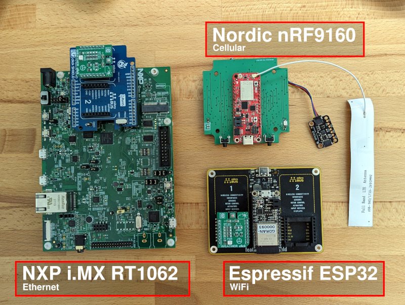

# Golioth Demo: IoT Weather Fleet

This repository demonstrates a very bare-bones temperature reporting
application. It highlights how to use [Zephyr
RTOS](https://www.zephyrproject.org/) to apply a single firmware project to
multiple different architectures and sensors without the need to specialize the
C code.



You can build this project for the Nordic nRF9160, NXP i.MX1062, or ESP32 and
your choice of an Infineon DPS310 or Bosch BME280 temperature sensor. The result
is a fleet of diverse hardware all sending temperature data to Golioth.

This demo was put together for the [*Building a modular codebase with Zephyr
RTOS and
Devicetree*](https://embeddedonlineconference.com/session/Building_a_Modular_Codebase_with_Zephyr_RTOS_and_Devicetree)
talk during the [2023 Embedded Online
Conference](https://embeddedonlineconference.com/).

## Golioth

[Golioth](https://golioth.io/) is an instant IoT cloud for firmware devices.
With Golioth, your project will have OTA, Time Series and Stateful data handling,
command and control, remote logging, and many other useful services from day
one.

[Try Golioth now](https://console.golioth.io/), your first 50 devices are free
with our Dev Tier.

## Setup

Do not clone this repo. Instead, use `west init` to set up a workspace with the
correct dependencies.

### Initial Setup

When building for a Nordic device, initialize using `west-ncs.yml`:

```
west init -m https://github.com/golioth/iot_weather_fleet.git --mf west-ncs.yml
west update
```

For all other devices, initialize using `west-zephyr.yml`

```
west init -m https://github.com/golioth/iot_weather_fleet.git --mf west-zephyr.yml
west update
```

### Changing between Zephyr and the nRF Connect SDK (NCS)

Existing installs may change between the two options by editing the value for
`file` in `../.west/config`:

```yaml
[manifest]
path = app
file = west-zephyr.yml

[zephyr]
base = deps/zephyr
```

After changing this file, run `west update`

## Building

Build and flash the project:

```
# SparkFun Thing Plus nRF9160 (uses west-ncs.yml)
west build -b sparkfun_thing_plus_nrf9160_ns .
west flash

# NXP i.MX RT1024 EVK (uses west-zephyr.yml)
west build -b mimxrt1024_evk .
west flash

# ESP32 (uses west-zephyr.yml)
west build -b esp32 .
west flash
```

## Save Device Credentials to Non-Volatile Storage

Each device needs to be assigned its own PSK-ID and PSK to authenticate with
Golioth. Devices that use WiFi also need an SSID and PSK. These are assigned
(once) via the serial console after the firmware has been flashed and will
persist across future firmware upgrades.

```
uart:~$ settings set wifi/ssid <my-wifi-ap-ssid>
uart:~$ settings set wifi/psk <my-wifi-ap-password>
uart:~$ settings set golioth/psk-id <my-psk-id@my-project>
uart:~$ settings set golioth/psk <my-psk>
uart:~$ kernel reboot cold
```

## How to Hardcode Device Credentials

If you prefer not to use the serial shell for device credentials, you may
hardcode them into the build. Uncomment the lines at the bottom of the prj.conf
file and replace the PSK-ID/PSK with your Golioth device credentials.
